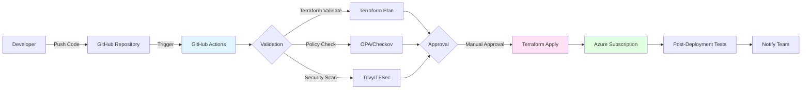

# Enterprise Azure Landing Zone

**Author:** Mohamed Dilshad KP  
**Role:** Senior DevOps Engineer  
**Repository:** Production-Grade Azure Landing Zone with Security, Networking & CI/CD

---

## 1. Overview

### What Problem This Landing Zone Solves

Enterprise organizations face significant challenges when adopting Azure at scale:

- **Lack of Governance**: Without proper structure, Azure subscriptions become unmanageable, leading to security gaps, cost overruns, and compliance violations
- **Inconsistent Security Posture**: Manual security configurations result in misconfigurations, exposed resources, and increased attack surface
- **Network Complexity**: Ad-hoc network designs create connectivity issues, security vulnerabilities, and operational overhead
- **Compliance Gaps**: Meeting regulatory requirements (SOC 2, ISO 27001, HIPAA) without automated policy enforcement is error-prone and costly
- **Cost Overruns**: Uncontrolled resource provisioning leads to budget overruns and wasted cloud spend
- **Operational Inefficiency**: Manual deployments, inconsistent environments, and lack of automation slow down development velocity

This Azure Landing Zone provides a **production-ready, enterprise-grade foundation** that addresses these challenges through:

- **Hierarchical Governance**: Management groups and subscription organization
- **Policy-Driven Security**: Automated enforcement of security and compliance standards
- **Hub-Spoke Network Architecture**: Centralized connectivity and security controls
- **Infrastructure as Code**: Version-controlled, repeatable deployments
- **CI/CD Integration**: Automated testing and deployment pipelines
- **Cost Management**: Policy-driven SKU restrictions and resource tagging

---

## 2. Architecture Diagram

```mermaid
graph TB
    subgraph "Azure AD Tenant"
        MG[Management Group Hierarchy]
        RBAC[RBAC Roles & Assignments]
    end
    
    subgraph "Management Groups"
        MG --> Root[Root Management Group]
        Root --> Platform[Platform Management Group]
        Root --> Landing[Landing Zones]
        Landing --> Prod[Production]
        Landing --> NonProd[Non-Production]
        Landing --> Sandbox[Sandbox]
    end
    
    subgraph "Hub Subscription"
        HubSub[Hub Subscription]
        HubVNet[Hub Virtual Network]
        HubFW[Azure Firewall]
        HubVPN[VPN Gateway]
        HubER[ExpressRoute Gateway]
        HubLog[Log Analytics Workspace]
        HubKV[Key Vault]
        HubBastion[Bastion Host]
    end
    
    subgraph "Spoke Subscription - Production"
        SpokeProd[Production Subscription]
        SpokeProdVNet[Spoke VNet - Prod]
        ProdApp1[App Workload 1]
        ProdApp2[App Workload 2]
    end
    
    subgraph "Spoke Subscription - Non-Production"
        SpokeNonProd[Non-Prod Subscription]
        SpokeNonProdVNet[Spoke VNet - NonProd]
        NonProdApp1[App Workload 1]
        NonProdApp2[App Workload 2]
    end
    
    subgraph "Identity & Security"
        AAD[Azure Active Directory]
        PIM[Privileged Identity Management]
        Policy[Azure Policy]
        Sentinel[Azure Sentinel]
    end
    
    subgraph "CI/CD"
        GitHub[GitHub Actions]
        Terraform[Terraform Cloud/State]
        Pipeline[Deployment Pipeline]
    end
    
    Platform --> HubSub
    Prod --> SpokeProd
    NonProd --> SpokeNonProd
    
    HubVNet --> HubFW
    HubVNet --> HubVPN
    HubVNet --> HubER
    HubVNet --> HubBastion
    
    HubVNet -.Peering.-> SpokeProdVNet
    HubVNet -.Peering.-> SpokeNonProdVNet
    
    SpokeProdVNet --> ProdApp1
    SpokeProdVNet --> ProdApp2
    SpokeNonProdVNet --> NonProdApp1
    SpokeNonProdVNet --> NonProdApp2
    
    AAD --> RBAC
    AAD --> PIM
    Policy --> MG
    Sentinel --> HubLog
    
    GitHub --> Pipeline
    Pipeline --> Terraform
    Terraform --> HubSub
    Terraform --> SpokeProd
    Terraform --> SpokeNonProd
    
    style Root fill:#e1f5ff
    style Platform fill:#fff4e1
    style HubSub fill:#ffe1f5
    style SpokeProd fill:#e1ffe1
    style SpokeNonProd fill:#ffffe1
```



### Architecture Components

#### **Management Group Hierarchy**
- **Root**: Top-level governance and policy inheritance
- **Platform**: Hub subscription for shared services
- **Landing Zones**: Workload subscriptions organized by environment

#### **Hub Subscription**
- **Virtual Network**: Central connectivity point (10.0.0.0/16)
- **Azure Firewall**: Centralized network security and inspection
- **VPN/ExpressRoute Gateways**: On-premises connectivity
- **Bastion Host**: Secure RDP/SSH access
- **Log Analytics Workspace**: Centralized logging and monitoring
- **Key Vault**: Centralized secrets management

#### **Spoke Subscriptions**
- **Production**: Business-critical workloads (10.1.0.0/16, 10.2.0.0/16)
- **Non-Production**: Development and testing (10.10.0.0/16, 10.20.0.0/16)
- **Network Peering**: Hub-to-spoke and spoke-to-spoke (as needed)

#### **Security & Governance**
- **Azure Policy**: Automated compliance enforcement
- **RBAC**: Least-privilege access model
- **Azure Sentinel**: Security information and event management (SIEM)
- **Privileged Identity Management**: Just-in-time access

---

## 3. Design Decisions

### Why Hub-Spoke Architecture?

**Centralized Security & Connectivity**
- Single point of control for network security policies
- Azure Firewall provides centralized threat protection and application rules
- Simplified on-premises connectivity (one VPN/ExpressRoute gateway)
- Reduced operational overhead and cost (shared network services)

**Scalability**
- Easy to add new spoke subscriptions without modifying hub
- Isolated workloads prevent blast radius of security incidents
- Flexible peering allows spoke-to-spoke communication when needed

**Compliance & Governance**
- Centralized logging and monitoring from hub
- Consistent network security policies across all spokes
- Easier to meet regulatory requirements with centralized controls

**Cost Optimization**
- Shared network services (Firewall, VPN Gateway) reduce per-subscription costs
- Efficient use of ExpressRoute bandwidth
- Centralized NAT Gateway reduces egress costs

### Why Management Groups?

**Hierarchical Governance**
- Policies and RBAC assignments cascade to all child subscriptions
- Single point of policy definition reduces administrative overhead
- Environment-specific policies (Prod vs NonProd) applied at appropriate levels

**Subscription Organization**
- Logical grouping by environment, business unit, or project
- Easier to track costs and apply budgets at management group level
- Simplified access control with inheritance

**Compliance & Auditing**
- Centralized compliance reporting across all subscriptions
- Easier to demonstrate policy enforcement to auditors
- Consistent naming conventions and tagging strategies

**Scalability**
- Support for thousands of subscriptions under a single hierarchy
- Easy to reorganize subscriptions without changing policies
- Supports complex organizational structures

### Why Policies Over Scripts?

**Declarative vs Imperative**
- Policies define **what** should be enforced, not **how** to enforce it
- Azure automatically remediates non-compliant resources
- No need to run scripts manually or schedule them

**Real-Time Enforcement**
- Policies evaluate resources continuously, not just at deployment time
- Automatic remediation prevents configuration drift
- Immediate detection of policy violations

**Audit & Compliance**
- Built-in compliance dashboard shows policy compliance across all resources
- Historical compliance data for audit trails
- Integration with Azure Monitor and Sentinel for alerting

**Cost & Efficiency**
- No infrastructure needed to run scripts (serverless)
- No scheduling or orchestration required
- Native integration with Azure Resource Manager

**Governance at Scale**
- Policies apply automatically to new subscriptions and resources
- No need to remember to run scripts for new deployments
- Consistent enforcement across all environments

---

## 4. Security Model

### RBAC (Role-Based Access Control)

#### **Custom Role Definitions**

```hcl
# Platform Administrator
- Full control over hub subscription
- Can manage network, firewall, and shared services
- Cannot access workload subscriptions

# Landing Zone Owner
- Contributor rights to assigned subscription
- Can deploy and manage resources
- Cannot modify network peering or hub resources

# Security Administrator
- Read access to all subscriptions
- Can manage security policies and Key Vault
- Can view security logs and alerts

# Network Administrator
- Can manage network resources (VNets, NSGs, peering)
- Cannot modify firewall rules (requires Platform Admin)
- Read-only access to hub subscription
```

#### **Privileged Identity Management (PIM)**
- **Just-in-Time Access**: Elevated permissions activated only when needed
- **Time-Limited**: Access expires after specified duration
- **Approval Workflow**: Critical roles require manager approval
- **Audit Trail**: All privilege escalations logged and monitored

#### **Service Principals for CI/CD**
- **Least Privilege**: Service principals have minimal required permissions
- **Managed Identity**: Where possible, use managed identities instead of secrets
- **Key Vault Integration**: Secrets stored in Key Vault, accessed via managed identity
- **Rotation**: Automated credential rotation for service principals

### Policy Enforcement

#### **Security Policies**

**Network Security**
- Enforce NSG rules on all subnets
- Require private endpoints for PaaS services
- Block public IPs on VMs (except approved exceptions)
- Enforce VNet peering only to hub

**Identity & Access**
- Require MFA for all user accounts
- Enforce conditional access policies
- Block service principals with owner role
- Require managed identities for applications

**Data Protection**
- Enforce encryption at rest for all storage accounts
- Require TLS 1.2+ for all connections
- Enforce Azure Disk Encryption for VMs
- Require Key Vault for secrets management

**Compliance**
- Enforce resource tagging (Environment, CostCenter, Owner)
- Require diagnostic settings for all resources
- Enforce log retention policies
- Block deployment of non-compliant resource types

#### **Policy Remediation**
- **Automatic Remediation**: Policies auto-remediate non-compliant resources
- **DeployIfNotExists**: Automatically deploy required configurations
- **Audit Mode**: For policies that cannot be auto-remediated, generate alerts

### Network Isolation

#### **Network Segmentation**
- **Hub Network**: 10.0.0.0/16 (shared services)
- **Production Spokes**: 10.1.0.0/16, 10.2.0.0/16 (isolated workloads)
- **Non-Production Spokes**: 10.10.0.0/16, 10.20.0.0/16 (dev/test)
- **DMZ Subnet**: Isolated subnet in hub for public-facing services

#### **Network Security Groups (NSGs)**
- **Deny by Default**: All traffic denied unless explicitly allowed
- **Application-Specific Rules**: NSGs tailored to each application tier
- **Azure Firewall Integration**: Centralized rules for internet-bound traffic
- **Service Tags**: Use Azure service tags for Azure service communication

#### **Private Endpoints**
- **PaaS Services**: All Azure PaaS services accessed via private endpoints
- **DNS Integration**: Private DNS zones for name resolution
- **No Public Exposure**: Eliminate public endpoints for internal services

#### **Azure Firewall Rules**
- **Application Rules**: Allow/deny based on FQDN
- **Network Rules**: Allow/deny based on IP/port
- **Threat Intelligence**: Automatic blocking of known malicious IPs
- **Logging**: All traffic logged to Log Analytics

---

## 5. CI/CD Flow

### Pipeline Architecture



### Pipeline Stages

#### **1. Validation Stage**
```yaml
- Terraform Format Check
- Terraform Validate
- Terraform Security Scan (TFSec/Checkov)
- Policy Compliance Check (OPA)
- Cost Estimation (Infracost)
```

#### **2. Planning Stage**
```yaml
- Terraform Init
- Terraform Plan
- Generate Plan Artifact
- Cost Impact Analysis
- Security Risk Assessment
```

#### **3. Approval Gate**
- **Manual Approval Required** for:
  - Production deployments
  - Network changes (VNets, peering, firewall rules)
  - Policy modifications
  - RBAC changes

#### **4. Deployment Stage**
```yaml
- Terraform Apply (with auto-approve for non-prod)
- Post-Deployment Validation
- Health Checks
- Integration Tests
```

#### **5. Post-Deployment**
```yaml
- Resource Validation
- Connectivity Tests
- Security Compliance Check
- Cost Verification
- Notification (Slack/Teams/Email)
```

### Pipeline Configuration

**Branch Strategy**
- `main`: Production deployments (requires approval)
- `develop`: Non-production deployments (auto-approve)
- `feature/*`: Validation only (no deployment)

**State Management**
- **Backend**: Azure Storage Account with state file locking
- **Workspaces**: Separate workspaces per environment
- **State Encryption**: State files encrypted at rest

**Secrets Management**
- **GitHub Secrets**: Service principal credentials
- **Azure Key Vault**: Resource-specific secrets
- **Managed Identity**: For Azure resource access

### Deployment Workflow

1. **Infrastructure Changes**: Developer commits Terraform code
2. **Automated Validation**: GitHub Actions runs validation checks
3. **Plan Review**: Team reviews Terraform plan output
4. **Approval**: Required approver reviews and approves
5. **Deployment**: Terraform applies changes to Azure
6. **Verification**: Automated tests verify deployment success
7. **Notification**: Team notified of deployment status

---

## 6. Cost Considerations

### Shared Services Model

**Cost Allocation**
- Hub costs allocated to workload subscriptions via tags
- Cost center tags enable chargeback to business units
- Azure Cost Management + Billing for detailed reporting

### Policy-Driven SKU Restrictions

**VM Size Restrictions**
```hcl
# Production: Allow up to Standard_D8s_v3
# Non-Production: Allow up to Standard_D4s_v3
# Sandbox: Allow up to Standard_D2s_v3
```

**Storage Account Restrictions**
- **Production**: Premium storage allowed
- **Non-Production**: Standard storage only
- **Block**: Block deployment of expensive SKUs (e.g., Ultra SSD in non-prod)

**Database Restrictions**
- **Production**: Business Critical tier allowed
- **Non-Production**: General Purpose tier only
- **Block**: Prevent deployment of expensive database SKUs in dev/test

**Network Restrictions**
- **Block**: Prevent deployment of expensive network resources (e.g., ExpressRoute in non-prod)
- **Enforce**: Use Basic SKU for non-production VPN gateways

### Log Retention Policies

**Cost-Optimized Retention**
- **Security Logs**: 90 days (required for compliance)
- **Application Logs**: 30 days (non-production), 90 days (production)
- **Audit Logs**: 1 year (compliance requirement)
- **Activity Logs**: 90 days (free tier)

**Log Analytics Optimization**
- **Data Collection Rules**: Collect only necessary logs
- **Log Filtering**: Filter out verbose/debug logs in non-production
- **Archive to Storage**: Move old logs to cheaper Azure Storage (hot/cool tier)
- **Sampling**: Reduce log volume for high-traffic applications

### Additional Cost Optimization Strategies

**Resource Tagging**
- **Environment**: Prod, NonProd, Sandbox
- **CostCenter**: Business unit or project code
- **Owner**: Team or individual responsible
- **Project**: Project identifier
- **Auto-Shutdown**: Schedule-based VM shutdown for non-production

**Reserved Instances**
- **1-Year Reserved**: For predictable production workloads (up to 72% savings)
- **3-Year Reserved**: For stable, long-running services (up to 80% savings)
- **Spot VMs**: For non-critical, fault-tolerant workloads (up to 90% savings)

**Azure Cost Management**
- **Budgets**: Set spending limits with alerts
- **Cost Alerts**: Notify when spending exceeds thresholds
- **Cost Analysis**: Regular reviews of spending by resource, tag, or subscription
- **Recommendations**: Automated cost optimization suggestions

---

## Project Structure

```
azure-landing-zone/
├── README.md
├── .gitignore
├── .github/
│   └── workflows/
│       ├── terraform-validate.yml
│       ├── terraform-plan.yml
│       └── terraform-apply.yml
├── infrastructure/
│   ├── hub/
│   │   ├── main.tf
│   │   ├── variables.tf
│   │   ├── outputs.tf
│   │   └── network.tf
│   ├── management-groups/
│   │   ├── main.tf
│   │   └── hierarchy.tf
│   ├── policies/
│   │   ├── security/
│   │   ├── networking/
│   │   ├── compliance/
│   │   └── cost/
│   ├── rbac/
│   │   ├── roles.tf
│   │   └── assignments.tf
│   └── spoke/
│       ├── production/
│       └── non-production/
├── scripts/
│   ├── setup.sh
│   └── validate.sh
├── docs/
│   ├── architecture.md
│   ├── security.md
│   └── deployment.md
└── terraform.tfvars.example
```

---

## Getting Started

### Prerequisites

- Azure CLI 2.50.0 or later
- Terraform 1.5.0 or later
- GitHub account with Actions enabled
- Azure subscription with Owner permissions
- Service Principal with appropriate permissions

### Initial Setup

1. **Clone the repository**
   ```bash
   git clone <repository-url>
   cd azure-landing-zone
   ```

2. **Configure Azure CLI**
   ```bash
   az login
   az account set --subscription <subscription-id>
   ```

3. **Create Service Principal**
   ```bash
   az ad sp create-for-rbac --name "terraform-sp" \
     --role "Owner" \
     --scopes /subscriptions/<subscription-id>
   ```

4. **Configure GitHub Secrets**
   - `AZURE_CLIENT_ID`: Service Principal App ID
   - `AZURE_CLIENT_SECRET`: Service Principal Password
   - `AZURE_TENANT_ID`: Azure AD Tenant ID
   - `AZURE_SUBSCRIPTION_ID`: Azure Subscription ID

5. **Customize Configuration**
   ```bash
   cp terraform.tfvars.example terraform.tfvars
   # Edit terraform.tfvars with your values
   ```

6. **Deploy Infrastructure**
   ```bash
   cd infrastructure/hub
   terraform init
   terraform plan
   terraform apply
   ```

---

## Contributing

This is a production-ready template. When adapting for your organization:

1. Review and customize policy definitions
2. Adjust network address spaces to match your requirements
3. Modify RBAC roles to align with your organizational structure
4. Update CI/CD pipelines with your approval workflows
5. Configure cost budgets and alerts

---

## License

This project is provided as-is for educational and reference purposes. Adapt as needed for your organization's requirements.

---

## Author

**Mohamed Dilshad KP**  
Senior DevOps Engineer

---

## References

- [Azure Landing Zone Documentation](https://docs.microsoft.com/azure/cloud-adoption-framework/ready/landing-zone/)
- [Azure Policy Samples](https://github.com/Azure/azure-policy)
- [Terraform Azure Provider](https://registry.terraform.io/providers/hashicorp/azurerm/latest/docs)
- [Cloud Adoption Framework](https://docs.microsoft.com/azure/cloud-adoption-framework/)

